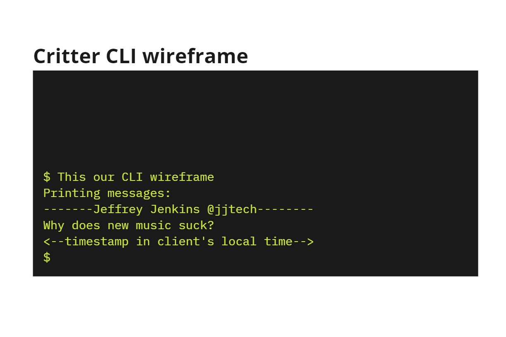
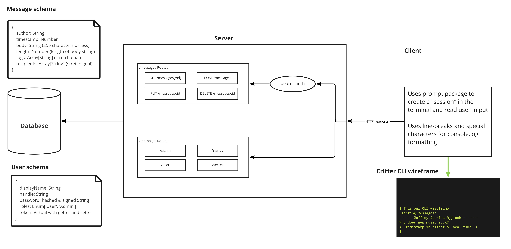

# Project Planning for Critter

## Wireframe



## User Stories


## Software Requirements

## Domain Modelling



## Database Schemas

### Messages Schema

```js
{
 author: String
 timestamp: Number
 body: String // (255 characters or less)
 length: Number // (length of body string)
 tags: Array[String] // (stretch goal)
 recipients: Array[String] // (stretch goal)
}

```

### User Schema

```js
{
 displayName: String
 handle: String
 password: hashed & signed String
 roles: Enum['User', 'Admin']
 token: Virtual // virtual String with getter and setter
}
```
